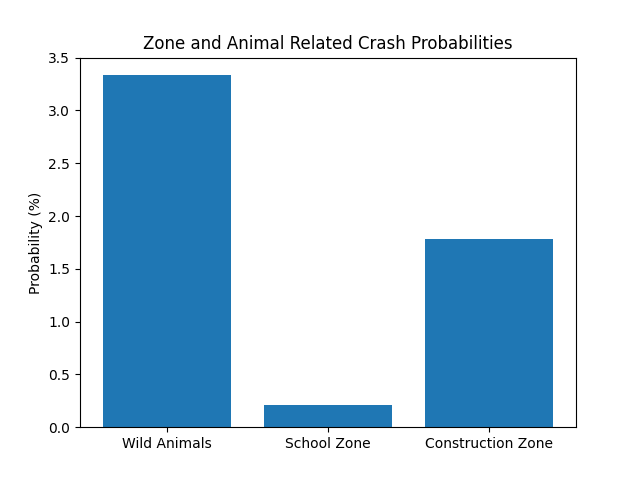
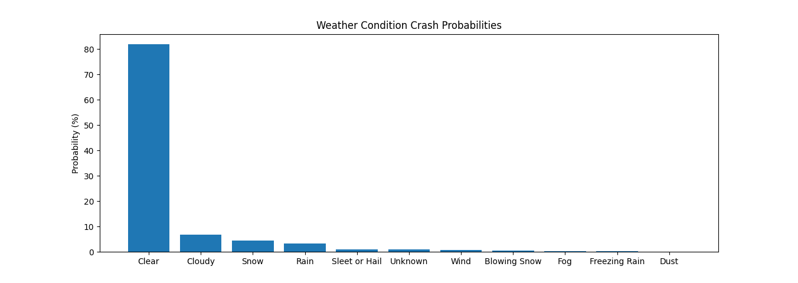
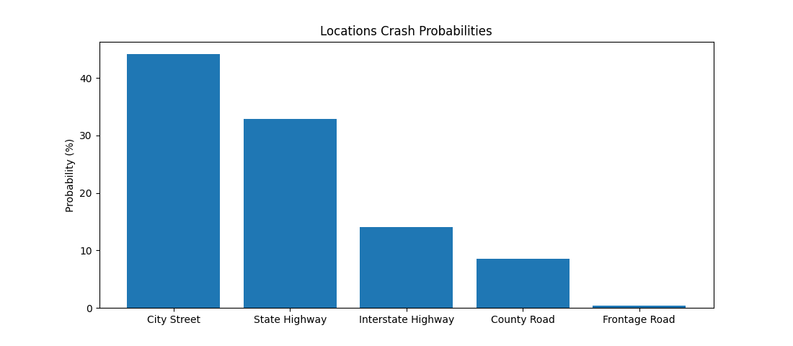
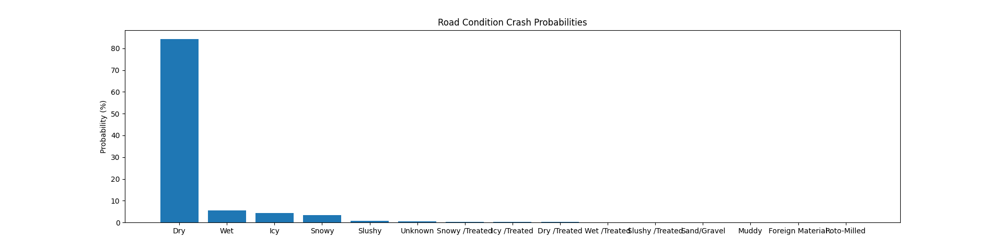
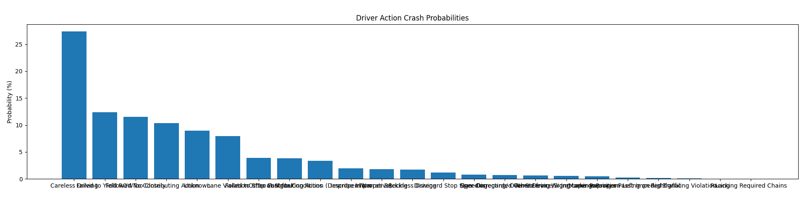
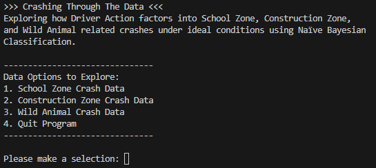

# Crashing Through the Data

**Exploring Colorado's Statewide Accident Trends**

This project serves as a code companion to the data digest and exploratory 
analysis presented in:
- [Crashing Through the Data](https://docs.google.com/document/d/1ZTHZTXQFD2DAC941J4DKAdF3wWawQLBsqgKOMONSCg4/edit?usp=sharing)
- [Video Presentation and Code Demonstration]()
- [Data Source - Colorado Crash Data](https://www.codot.gov/safety/traffic-safety/data-analysis/crash-data)
- [Data Source - Normalized](https://drive.google.com/drive/folders/1bAJI7zsjkeqHfZvijk4FTBN3Hk0_4SpM?usp=drive_link)

## Project Overview

This data analysis investigates whether **Driver Action** is a predictable 
contributing factor in varous crash types under ideal weather and road 
conditions. 

Initial exploration revealed that most accidents in Colorado between
2021 and 2024, inclusive, occured under ideal conditions. This finding motivated
a deeper dive into specific crash categories and the role of driver behavior.

As a result the following primary question was asked:

**To what extent is *Driver Action* a contributing factor in three specific 
crash types&mdash;*Wild Animal*, *School Zone*, and *Construction Zone*&mdash;under ideal weather and road conditions?**

## Key Findings

- **Wild Animal** crashes occur far more frequently than both **School Zone** 
  and **Construction Zone** crashes.
- The initial assumption was that **Construction Zone** crashes would be the 
  most common of the three due to their constrained and chaotic nature. This 
  expectation proved incorrect.
- Further inspection revealed that **over 10% of all crashes (2021-2024) list 
  "No Contributing Action" by the driver.**
- This led to examining whether:
  + Wild Animal crashes are predominantly unrelated to driver behavior, while
  + School Zone and Construction Zone crahes might more often involve 
    identifiable contributing Driver Actions.

To investigate these hypotheses, the project builds and evaluates a *Naive Bayes
Classification Model* that predicts whether a driver involved in one fo the three
crash types had a **Contributing Action** or **No Contributing Action** recorded.

## The Code

#### File Structure

```yaml
root/
│
├── assets/
│   ├── 2021-Crash-Data-Normalized.csv
│   ├── 2022-Crash-Data-Normalized.csv
│   ├── 2023-Crash-Data-Normalized.csv
│   ├── 2024-Crash-Data-Normalized.csv
│   ├── all-crash-data.csv
│   │
│   ├── plots/
│   │   ├── driver-action-probs.png
│   │   ├── location-probs.png
│   │   ├── main-prog-img.png
│   │   ├── road-probs.png
│   │   ├── weather-probs.png
│   │   ├── zone-and-animal-probs.png
│
├── initial_data_digest_and_plots/
│   ├── crash-data-basic-probabilities.py
│   ├── test-animal-zone-driver-attention.py
│
├── program/
│   ├── constructionZoneAndDriverAction.py
│   ├── main.py
│   ├── schoolZoneAndDriverAction.py
│   ├── wildAnimalAndDriverAction.py
│
├── .gitignore
└── README.md
```

### Initial Data Digest and Plots

This secion of code summarizes the perliminary data inspection and 
visualizations used to understand the crash data and build the initial 
classification model.











## Main Program

The main program (main.py) provides and interactive interface that allows the 
user to:
- explore crash data for the specified categories (**Wild Animal**, 
  **School Zone**, **Construction Zone**)
- view probability statistics for **Driver Actions** in conjunction with ideal
  conditions for the three crash types
  + (**School Zone: True** | **Weather Condition: Clear** | **Road Condition: Dry**)
  + (**Construction Zone: True** | **Weather Condition: Clear** | **Road Condition: Dry**)
  + (**Wild Animal: True** | **Weather Condition: Clear** | **Road Condition: Dry**)
- run the Naive Bayes classification model of the above crash types and 
  conditions to predict **Driver Action** contribution.

### Setup

1. Clone the reposetroy
2. Create or download the `all_crash_data.csv` file
  - To creat via command line navigate to the assets folder and run the folloing
    command: `copy *.csv all_crash_data.csv`
    + The above action will include the header line from all 4 crash data files, 
      make sure to leave the first and remove the additional 3 located throughout
      the new file.
  - A download to the `all_crash_data.csv` file can be found [here](https://drive.google.com/file/d/18KWsOPQOw5ksQY1zib856fuv5JSsZD3Y/view?usp=sharing)

### Running the Program

1. Navigate to the program folder
2. Run `python main.py`

   You should see the following output

   

3. Explore!